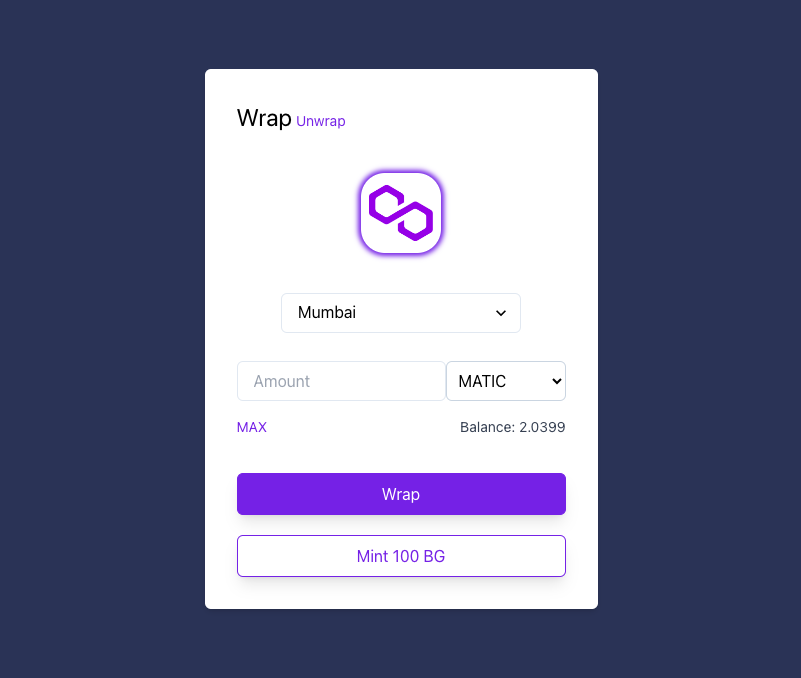

# Token Wrapper

<p align="center">

</p>

[Token Wrapper](https://token-wrapper.vercel.app) is a Decentralized Application which enables users to wrap Native and ERC20 tokens on supported EVM compatible chains. Currently supports Mumbai with FREE! BuidlGuidl token mint🫡🏘

# Local Development

### Install dependencies:

```shell
yarn
```

### Run unit tests:

```shell
yarn test
```

### Deploy contracts:

```shell
yarn deploy
```

### Run frontend:

```shell
yarn start
```

# Acknowledgements

- [ScaffoldETH V2](https://github.com/scaffold-eth/se-2)
